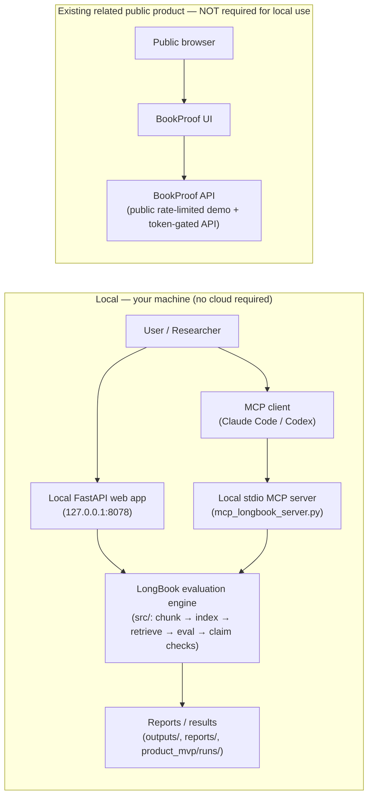

# Architecture

One evaluation engine, reached three ways locally, plus a separate existing public product.

## Notes
- The **local engine** (`src/`) is self-contained: chunking, deterministic index build
  (`hashing_numpy`), retrieval, the five methods, metrics, and claim verification.
- The **local web app** and the **local stdio MCP server** are two front-ends over that same engine.
  Both run entirely on your machine.
- **BookProof** is an **existing, related public product** (a deployed instance of this evaluation,
  [try it online](https://tts.bedvibe.studio/bookproof/app/)). It is shown here for context only and
  is **not a dependency** of the local stack — nothing in this repository calls it to run locally.
